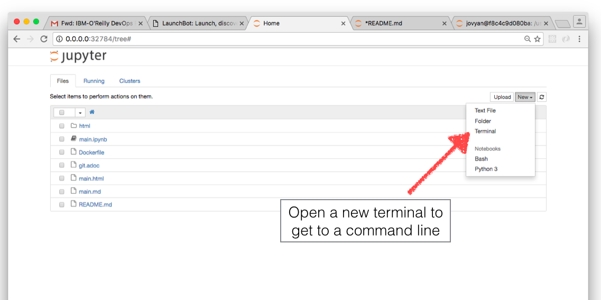

# Building with NPM

First, from your host, run this:

```
jupyter nbconvert --to markdown main.ipynb
```

Then, convert that to HTML:

```
npm run build
```


# Converting Notebook to Markdown

You can use Jupyter built-in `nbconvert` tool to convert the notebook into Markdown or HTML.  To do this, use the terminal built into Jupyter to get to a command line:



Then, run this:

```
jupyter nbconvert --to markdown main.ipynb
```

For HTML, run this:

```
jupyter nbconvert --to html --template basic main.ipynb
```

If you need more expotic formats, you can also just run `pandoc`, which is also installed on this base image.
